# GroupAvail - User and Developer Information

## Overview

GroupAvail is a Gmail [Workspace Add On](https://developers.google.com/workspace/add-ons/overview)  that searches Googlers' calendars, generates  and inserts a formatted list of merged available dates and times in the Gmail message body. The list can then be edited and shared with external customers and partners in the email.  Editable text, like what is shown below, is inserted into the email body wherever the cursor is located when the add-on is run:
 ```
      Available Times (ET)
         **  Mon (May 1) :** 
             09:00 am to 11:30 am 
             12:00 pm to 01:00 pm 
        **  Tue (May 2) :** 
             09:00 am to 09:30 am 
             11:30 am to 01:30 pm 
             04:00 pm to 05:00 pm
```         
This document provides a high-level overview of usage and processes to get started, update, test, debug, deploy and monitor the GroupAvail AddOn.

## Usage when Installed
Users typically install GroupAvail from the organization's Workspace Marketplace. (Instructions below describe the developer deployment processes.)
Once installed, a blue calendar image button is added to the bottom of the Gmail Compose window like this:

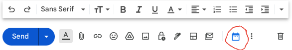

After the user enters to, cc and bcc email addresses (from their organization) into the GMail compose window fields, they can then push the blue button and a pop-up box will prompt the user for more information like this:

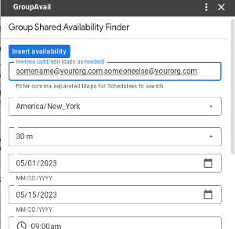

After providing the paremeters in the form to specify date/time range, timezone and more, selecting the "Insert Availability" button will directly insert the formated schedule availability into the email body wherever the cursor was when the steps above were initiated. 
## Mobile Support
The GroupAvail Add-On also works in users' mobile Gmail application. Instead of starting with a blue icon in the Gmail compose window tray, a menu item "Insert from GroupAvail" is added to the Gmail App Compose menu (the three vertical dots in the upper right corner of the screen.) When the GroupAvail menu item is selected, the behavior of the mobile add-on is identical to the web based version except that native mobile UI look and feel for date and time pickers are used.

The screenshots below show the location of the menu, menu item, then the form and appearance when run.
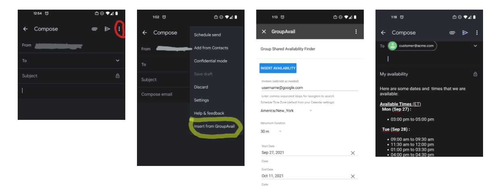

## Privacy
GroupAvail captures no data except for diagnostic logging and (optionally) Google Analytics for usage. In its logging, GroupAvail makes use of Cloud Logging from Apps Script for diagnostic purposes with the following notable details:
- GroupAvail does not log any user identities, email addresses or meeting descriptions (details are redacted for user email addresses and the description length for meeting descriptions in case matching to specific user supplied data is required outside of the log data.)
- GroupAvail logged debug data includes the user request data (minus identities/email addresses),  meeting time slots to allow diagnostics for issues that users report.
- For Google Analytics data, the analytics ID must be set up for the organization using GroupAvail. When analytics are used, user identiy is not included in the tracking (only the following event occurances and their date/time: Add-On Installation, Add-On removal and Execution of a GroupAvail availability search. 

## Limitations
* GroupAvail currently only supports American and European time zones and date/time formatting output options. The user interface and all output is English only. 
* Based on conventions in the the initially deployed groups using GroupAvail, the available time search assumes that unaccepted invitations are to be included in available time (unlike the Free/Busy view which treats unaccepted calendar entries as blocked.)
* Start and end times are rounded to the nearest 15 minute time  - Blocked times will be either made later (start time rounded up)  or earlier (end time rounded down) to establish availability. 
* Start end end times are based on GroupAvail parameters only and calendar working hours are not used to limit availability (the Calendar API does not currently make these calendar settings available.)
* An evident defect in either GMail Smart Compose or the Workspace Add On CardService used by GroupAvail causes the Add On to insert the schedule availability content inside of and above the  +<email address> entry when used to add addresses to an email using the feature. The work around is to move the cursor above the +<email address>  entry before launching GroupAvail, and cut/paste the output to the desired location in the email body. 


## Development and Testing 

The development of GroupAvail is much the same as any other Apps Script project, with the addition of artifacts needed to support deploying and running GroupAvail as a Workspace AddOn (as described below) and privileges set up for permission acceptance by users for Calendar and Gmail API access. 
 
First, a few notes on files within the project:

1. <strong><code>Environment.js</code></strong> contains global javascript variables that you will need to tailor to your deployment environment. This includes the domain, error message text, image locations, location of "about" content and more.
2. <strong><code>appsscript.json</code></strong> is a [manifest](https://developers.google.com/apps-script/concepts/manifests) that specifies properties for the Add On deployment including Workspace trigger connections to Apps Script functions, security Oauth scopes and related declarations (to allow the user to see and accept required privileges) and information describing how the Add On is to appear in the Gmail interface. This file name and its json specified parameters are prescribed by AppsScript deployment tooling and partially managed in the IDE’s project properties (e.g. GCP project and Cloud Logging settings).
3. <strong><code>GmailAddOn.js</code></strong>: The AddOn UI and triggers that perform capture of user parameters and drive the operation of the actions.
4. <strong><code>GroupAvailLib.j</code>s</strong>: Includes the core functions that perform the calendar search/merge and extraction of shared availability time for specified users and date/time parameters.
5. <strong><code>TimeSupport.js</code></strong>: Library of supporting functions that handle timezone mapping and differences/conversions in time/date format in the Calendar API, the Addon API and Javascript.  
6. <strong><code>TestCases.js</code>: </strong>A small set of javascript stubs used during development to incremental build/test portions of the app. Its future could include a more rigorous set of test cases/assertions and ensure better code coverage.


## Developer's Getting Started
There are two ways to install GroupAvail to Apps Script from this repo. The first is to set up a project in Apps Script IDE and copy/paste the code into the project. The second is to use <code>clasp</code>, an open source command line tool based on Node.js. Both approaches are described below.

### Pasting code into the IDE
To get started with the current release using the IDE, first create a new [Apps Script](https://script.google.com/) project. Then manually create each of ".js" files in the Apps Script IDE for the files in this repo. You also will need to enable <code>Show "appsscript.json" manifest file in editor</code> in the Project Settings.  Simply copy/paste the Apps Script code and <code>appscript.json</code> contents into each of the files. You will also need to make updates to <code>Environment.js</code>  to specify your environment. You may need to update appscript.json file with other environment specific configuration information that includes details of the permissions required by the add on when deployed to Gmail.

### Using the Command line
You will need to have Node.js and clasp installed as a prerequisite. Instructions for how to ensure the correct Node.js version is installed and the steps to install <code> clasp</code> are available here:
https://developers.google.com/apps-script/guides/clasp
https://codelabs.developers.google.com/codelabs/clasp/#0

You will also need to configure Apps Script to enable use of the API here.
https://script.google.com/home/usersettings?pli=1

Next, you can log clasp into Apps Script
```
clasp login
```
A browser tab will open with an authentication prompt. After clicking "Allow", the clasp command line wil have an authenticated URL to use for the commands and API.

In the directory where the GroupAvail repo has been cloned.
```
clasp create --type standalone GroupAvail
```
Modify Environment.js to your org or individual values. This can also be done in the Apps Script IDE before deploying the app.

And to push the files into App Script:
```
clasp push
```
Note that some files are not valid for pushing to Apps Script and not pushed as a result of  inclusion in .`claspignore`.

Once the project is pushed, you can open it in the IDE, deploy to your Gmail envirnment and test (and later publish for all users in your organization's Marketplace if desired.)


## Working on GroupAvail

There are two options for interactive test/development depending on the feature/bug being worked on.

1. **As a test deployment to your Gmail client**: You can install and test the head version of the code as a Test Deployment against the in your connected Gmail account. Select "Deploy", then "Test Deployments" and then "Done" to connect the head version of the code to your Gmail runtime (after a hard refresh of the browser tab). The blue calendar logo will appear at the bottom of the compose window and you can interactively test, modify and view log messages in the IDE in parallel to use in Gmail. 
2. **Interactively in the IDE**: A crude collection of test drivers are in TestCases.js. You can select which test case to run at the top of the editor and use either “Run” or “Debug” as needed. In the current code base, the tests are not developed as a comprehensive suite with test correctness assertions, but as stubs that can run specific functions within the Add-On code base without deploying and running the App in Gmail.

## Add On Versioning
You may want to consider how to manage thesimple version string is specified at the top of Environment.js. This string is available in the user interface and in log messages to view end-user version deployed to help you know what is running for users when deployed through your marketplace.

## Create a New Deployment for the Marketplace

After satisfactory testing using TestCases.js stubs and running the head version in your personal Gmail environment, you will next need to create a production deployment in the Apps Script editor. To start, select “Deploy” (more detail on Deployment is provided [here](https://developers.google.com/apps-script/concepts/deployments).)

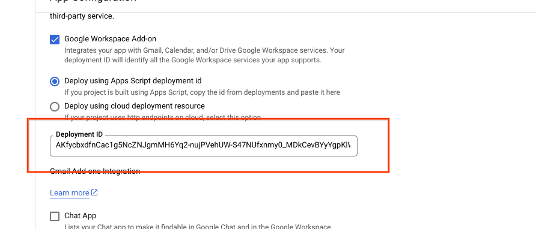

Next, select “**New Deployment**” from the Deploy menu.

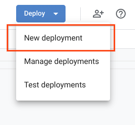


Add a description of the deployment for future IDE reference (this string is not displayed to users.)

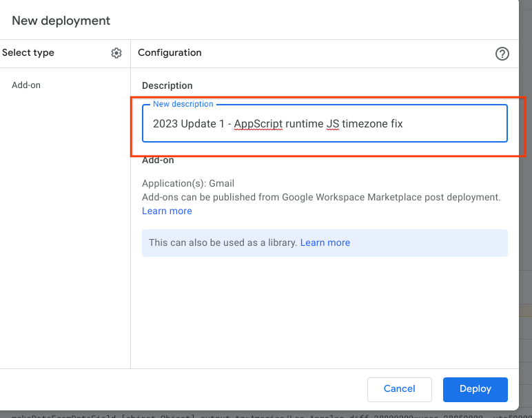


Click on the “**Deploy**” button.

After this step, you will be presented with a long **Deployment ID **string that you must copy and save for later use as described in the Google Cloud project deployment process [here](#deploying-a-new-groupavail-version-to-pantheon).


## Deploying a new GroupAvail version to Google Cloud

Log On to your Google Cloud account and navigate to the GroupAvailProd project using the options at the top of the menu (you will separately need to be granted access to the project prior this step.)

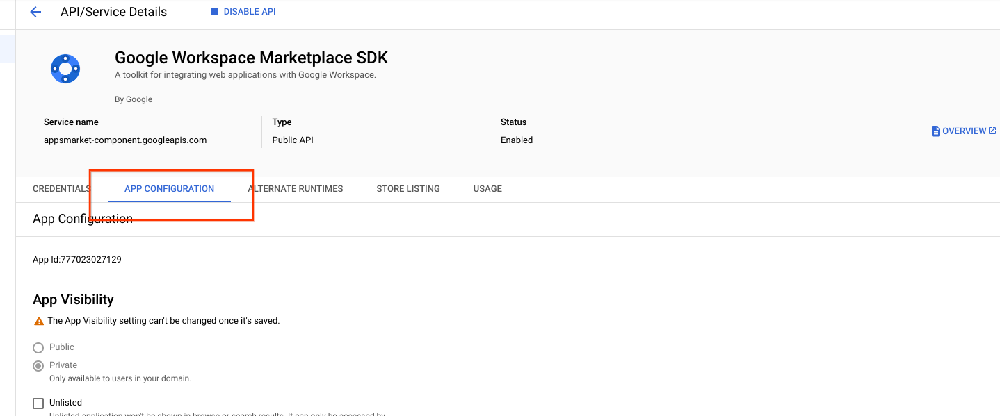


Search for **“Google Workspace Marketplace SDK” **in the search bar.

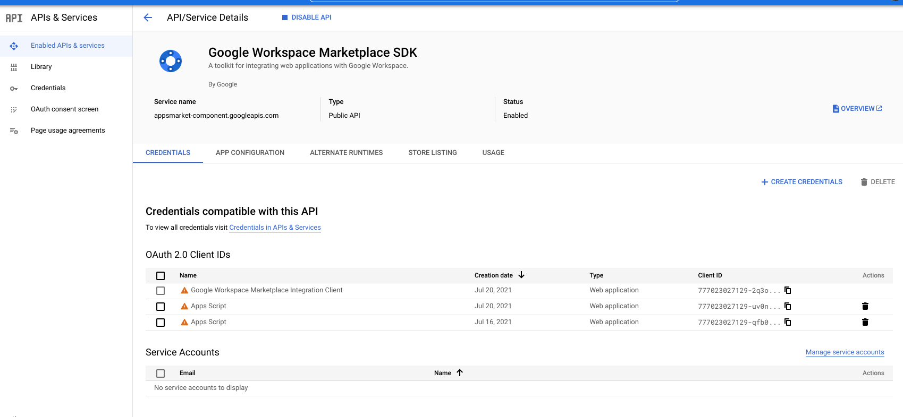


Select “**MANAGE**”

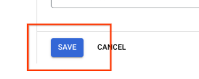


And then “**API CONFIGURATION**”

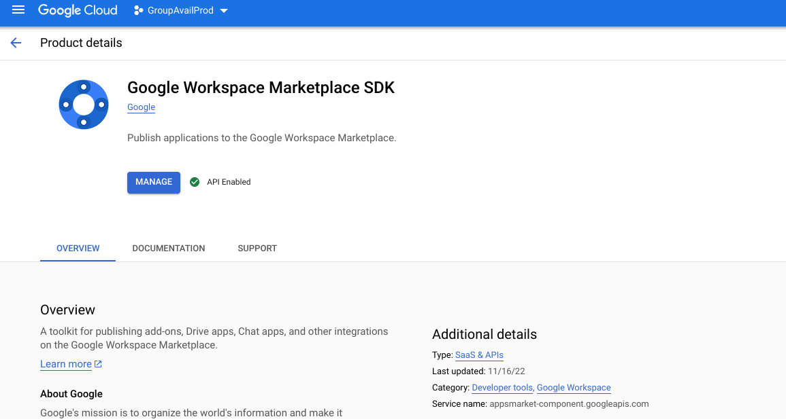


Update the deployment ID with the new deployment identifier from Apps Script Deployment in the field as shown below.

 \

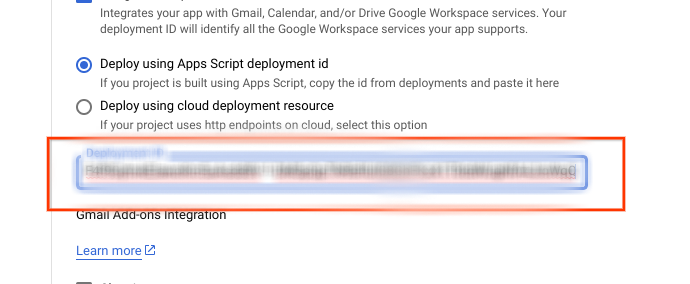


Paste the new ID from the Deployment in the Apps Script Editor (Deployment creation is outlined in [this section](#create-a-new-deployment))


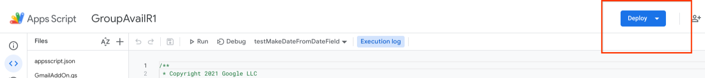


Scroll to the bottom of the page and click Save \


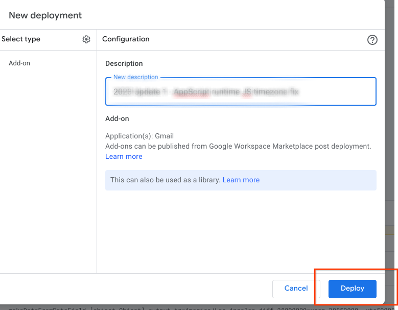


## User Add-On Client Reloading 

A hard browser refresh on the tab/window running Gmail will force the latest deployment to load to the client runtime.

**<Hold Shift Key> Refresh** Button

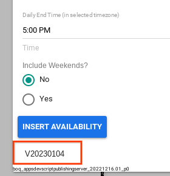

Users can verify the GroupAvail version running in their Gmail environment by drafting an email and initiating a GroupAvail session. Check the version at the bottom of the GroupAvail pop-up input form to verify that the proper version is running (see the  GroupAvail site at GroupAvail for release notes.)

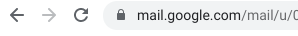

## Maintaining The Workspace Marketplace Page

TODO: more to come

## Monitoring Usage Tracking and Logging

A one-pixel image Google Analytics tracker URL can be embedded in the user input form to gather usage statistics.  You can set up your own GA project and specify the ID in the Environment file. To disable analytics tracking, the tracker ID can be set to "NONE" which is the default.

The Apps Script code is also instrumented with selected Logging statements (which are routed to Cloud Logging by the Apps Script runtime). Logs are available in the GCP project used above. 

No user specific information is collected (including emails of users/schedulees and calendar entry subjects.) 
 
 
