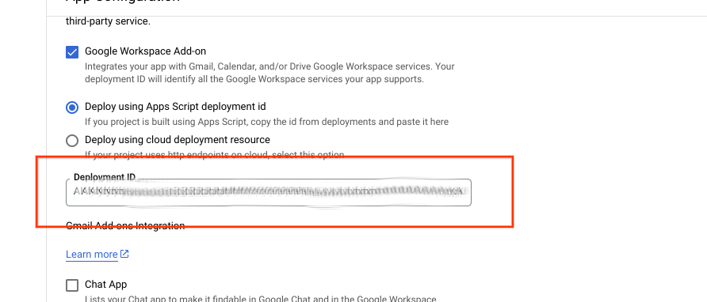

# GroupAvail Developer


[TOC]


## Overview {#overview}

GroupAvail is a Gmail Add On  that searches Googlers' calendars, generates  and inserts a formatted list of merged available dates and times in the Gmail message body. The list can then be edited and shared with external customers and partners in the email.  Editable text, like what is shown below, is inserted into the email body wherever the cursor is located when the add-on is run:
 ```
      Available Times (ET)
         **  Mon (May 1) :** 
             09:00 am to 11:30 am 
             12:00 pm to 01:00 pm 
        **  Tue (May 2) :** 
             09:00 am to 09:30 am 
             11:30 am to 01:30 pm 
             04:00 pm to 05:00 pm
```         
This document provides a high-level overview of processes to get started, update, test, debug, deploy and monitor the GroupAvail AddOn.


## Development and Testing Notes {#development-and-testing-notes}

The development of GroupAvail is much the same as any other AppsScript code, with the addition of artifacts needed to support deploying and running GroupAvail as a Workspace AddOn with specific privileges for Calendar and Gmail feature access. Notes on the specific files within the project:

1. **<code>appsscript.json</code></strong> is a [manifest](https://developers.google.com/apps-script/concepts/manifests) that specifies properties for the Add On deployment including Workspace trigger connections to Apps Script functions, security Oauth scopes and related declarations (to allow the user to see and accept required privileges) and information describing how the Add On is to appear in the Gmail interface. This file name and its json specified parameters are prescribed by AppsScript deployment tooling and partially managed in the IDE’s project properties (e.g. GCP project and Cloud Logging settings).
2. <strong><code>GmailAddOn.js</code></strong>: The AddOn UI and triggers that perform capture of user parameters and drive the operation of the actions.
3. <strong><code>GroupAvailLib.j</code>s</strong>: Includes the core functions that perform the calendar search/merge and extraction of shared availability time for specified users and date/time parameters.
4. <strong><code>TimeSupport.js</code></strong>: Library of supporting functions that handle timezone mapping and differences/conversions in time/date format in the Calendar API, the Addon API and Javascript.  
5. <strong><code>TestCases.js</code>:  </strong>A small set of javascript stubs used during development to incremental build/test portions of the app. Its future could include a more rigorous set of test cases/assertions and ensure better code coverage.


## Getting Started
At the time of writing, the clasp commands to push the code to Apps Script IDE is being defined. To get started sooner, create a new Apps Script project and create the ".js" files from this project and manually copy/paste the code into each. You will also need to create and update the appscript.json file with configuration information that include details of the permissions required by the add on when deployed to Gmail.

## Working on GroupAvail

There are two options for interactive test/development depending on the feature/bug being worked on.

1. **Interactively in the IDE**: A crude collection of test drivers are in TestCases.js. You can select which test case to run at the top of the editor and use either “Run” or “Debug” as needed. In the current code base, the tests are not developed as a comprehensive suite with test correctness assertions, but as stubs that can run specific functions within the Add-On code base without deploying and running the App in Gmail.
2. **As a test deployment to your Gmail client**: You can install and test the Test Deployment against the Head revision in your connected Gmail account. Add On Versioning

A very simple version string is specified at the top of GmailAddon.js. This string is available in the user interface and in log messages to view end-user version deployed.

## Create a New Deployment

After satisfactory testing using TestCases.js stubs and running the head version in your personal Gmail environment, you will next need to create a production deployment in the Apps Script editor. To start, select “Deploy” (more detail on Deployment is provided [here](https://developers.google.com/apps-script/concepts/deployments).)




Next, select “**New Deployment**” from the Deploy menu.


<p id="gdcalert2" ><span style="color: red; font-weight: bold">>>>>  GDC alert: inline image link here (to images/image2.png). Store image on your image server and adjust path/filename/extension if necessary. </span><br>(<a href="#">Back to top</a>)(<a href="#gdcalert3">Next alert</a>)<br><span style="color: red; font-weight: bold">>>>> </span></p>


Add a description of the deployment for future IDE reference (this string is not displayed to users.)


<p id="gdcalert3" ><span style="color: red; font-weight: bold">>>>>  GDC alert: inline image link here (to images/image3.png). Store image on your image server and adjust path/filename/extension if necessary. </span><br>(<a href="#">Back to top</a>)(<a href="#gdcalert4">Next alert</a>)<br><span style="color: red; font-weight: bold">>>>> </span></p>


Click on the “**Deploy**” button.


<p id="gdcalert4" ><span style="color: red; font-weight: bold">>>>>  GDC alert: inline image link here (to images/image4.png). Store image on your image server and adjust path/filename/extension if necessary. </span><br>(<a href="#">Back to top</a>)(<a href="#gdcalert5">Next alert</a>)<br><span style="color: red; font-weight: bold">>>>> </span></p>


After this step, you will be presented with a long **Deployment ID **string that you must copy and save for later use as described in the Google Cloud project deployment process [here](#deploying-a-new-groupavail-version-to-pantheon).


## Deploying a new GroupAvail version to Google Cloud

Log On to your Google Cloud account and navigate to the GroupAvailProd project using the options at the top of the menu (you will separately need to be granted access to the project prior this step.)


<p id="gdcalert5" ><span style="color: red; font-weight: bold">>>>>  GDC alert: inline image link here (to images/image5.png). Store image on your image server and adjust path/filename/extension if necessary. </span><br>(<a href="#">Back to top</a>)(<a href="#gdcalert6">Next alert</a>)<br><span style="color: red; font-weight: bold">>>>> </span></p>


Search for **“Google Workspace Marketplace SDK” **in the search bar.


<p id="gdcalert6" ><span style="color: red; font-weight: bold">>>>>  GDC alert: inline image link here (to images/image6.png). Store image on your image server and adjust path/filename/extension if necessary. </span><br>(<a href="#">Back to top</a>)(<a href="#gdcalert7">Next alert</a>)<br><span style="color: red; font-weight: bold">>>>> </span></p>


Select “**MANAGE**”


<p id="gdcalert7" ><span style="color: red; font-weight: bold">>>>>  GDC alert: inline image link here (to images/image7.png). Store image on your image server and adjust path/filename/extension if necessary. </span><br>(<a href="#">Back to top</a>)(<a href="#gdcalert8">Next alert</a>)<br><span style="color: red; font-weight: bold">>>>> </span></p>


And then “**API CONFIGURATION**”


<p id="gdcalert8" ><span style="color: red; font-weight: bold">>>>>  GDC alert: inline image link here (to images/image8.png). Store image on your image server and adjust path/filename/extension if necessary. </span><br>(<a href="#">Back to top</a>)(<a href="#gdcalert9">Next alert</a>)<br><span style="color: red; font-weight: bold">>>>> </span></p>


Update the deployment ID with the new deployment identifier from Apps Script Deployment in the field as shown below.

 \


<p id="gdcalert9" ><span style="color: red; font-weight: bold">>>>>  GDC alert: inline image link here (to images/image9.png). Store image on your image server and adjust path/filename/extension if necessary. </span><br>(<a href="#">Back to top</a>)(<a href="#gdcalert10">Next alert</a>)<br><span style="color: red; font-weight: bold">>>>> </span></p>


Paste the new ID from the Deployment in the Apps Script Editor (Deployment creation is outlined in [this section](#create-a-new-deployment))


<p id="gdcalert10" ><span style="color: red; font-weight: bold">>>>>  GDC alert: inline image link here (to images/image10.png). Store image on your image server and adjust path/filename/extension if necessary. </span><br>(<a href="#">Back to top</a>)(<a href="#gdcalert11">Next alert</a>)<br><span style="color: red; font-weight: bold">>>>> </span></p>


Scroll to the bottom of the page and click Save \


<p id="gdcalert11" ><span style="color: red; font-weight: bold">>>>>  GDC alert: inline image link here (to images/image11.png). Store image on your image server and adjust path/filename/extension if necessary. </span><br>(<a href="#">Back to top</a>)(<a href="#gdcalert12">Next alert</a>)<br><span style="color: red; font-weight: bold">>>>> </span></p>


## User Add-On Client Reloading  {#user-add-on-client-reloading}

A hard browser refresh on the tab/window running Gmail will force the latest deployment to load to the client runtime.

**<Hold Shift Key> Refresh** Button


<p id="gdcalert12" ><span style="color: red; font-weight: bold">>>>>  GDC alert: inline image link here (to images/image12.png). Store image on your image server and adjust path/filename/extension if necessary. </span><br>(<a href="#">Back to top</a>)(<a href="#gdcalert13">Next alert</a>)<br><span style="color: red; font-weight: bold">>>>> </span></p>


Users can verify the GroupAvail version running in their Gmail environment by drafting an email and initiating a GroupAvail session. Check the version at the bottom of the GroupAvail pop-up input form to verify that the proper version is running (see the  GroupAvail site at GroupAvail for release notes.)


<p id="gdcalert13" ><span style="color: red; font-weight: bold">>>>>  GDC alert: inline image link here (to images/image13.png). Store image on your image server and adjust path/filename/extension if necessary. </span><br>(<a href="#">Back to top</a>)(<a href="#gdcalert14">Next alert</a>)<br><span style="color: red; font-weight: bold">>>>> </span></p>


## Maintaining The Workspace Marketplace Page

<more to come>


## Monitoring Usage Tracking and Logging {#monitoring-usage-tracking-and-logging}

A one-pixel image Google Analytics tracker URL is embedded in the user input form to gather usage statistics.  You can set up your own GA project and specify the ID in the Environment file

The Apps Script code is also instrumented with selected Logging statements (which are routed to Cloud Logging by the Apps Script runtime). Logs are available in the GCP project used above. 

No user specific information is collected (including emails of users/schedulees and calendar entry subjects.)
